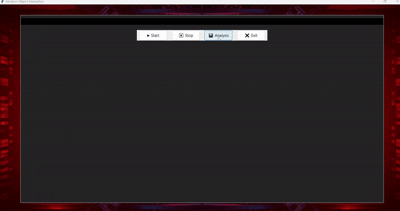

# Real-Time Emotion Prediction Based on Object Interaction.

This project demonstrates a real-time system that detects **facial emotions** and recognizes **objects (phones, books, etc.)** to analyze emotional behavior based on object interaction.

> 🎯 This project is part of my research titled:  
> **"Real-Time Emotion Prediction Based on Object Interaction: A Case Study of Phones and Books"**  
> 📅 Research is ongoing. Full paper submission is planned.

## Features

- 📷 Live camera feed
- 🤖 Object detection using YOLOv8
- 😊 Emotion recognition using DeepFace
- 📊 In-UI emotion-object analysis (bar chart)
- 🖼️ Animated background with stylish UI

## Demo


- only for the ui showcase of project how works .

## Installation

```bash
pip install -r requirements.txt
```
### Run the projecct 
```bash
python gui.py
``````


